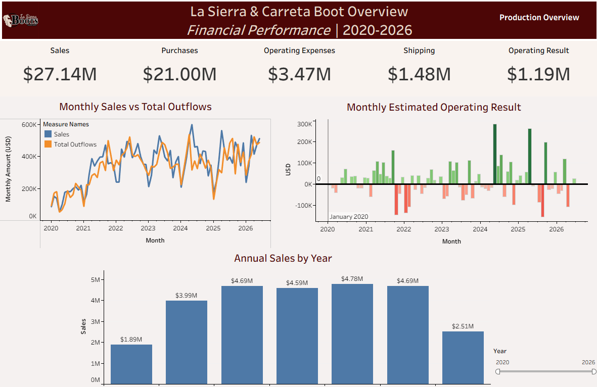
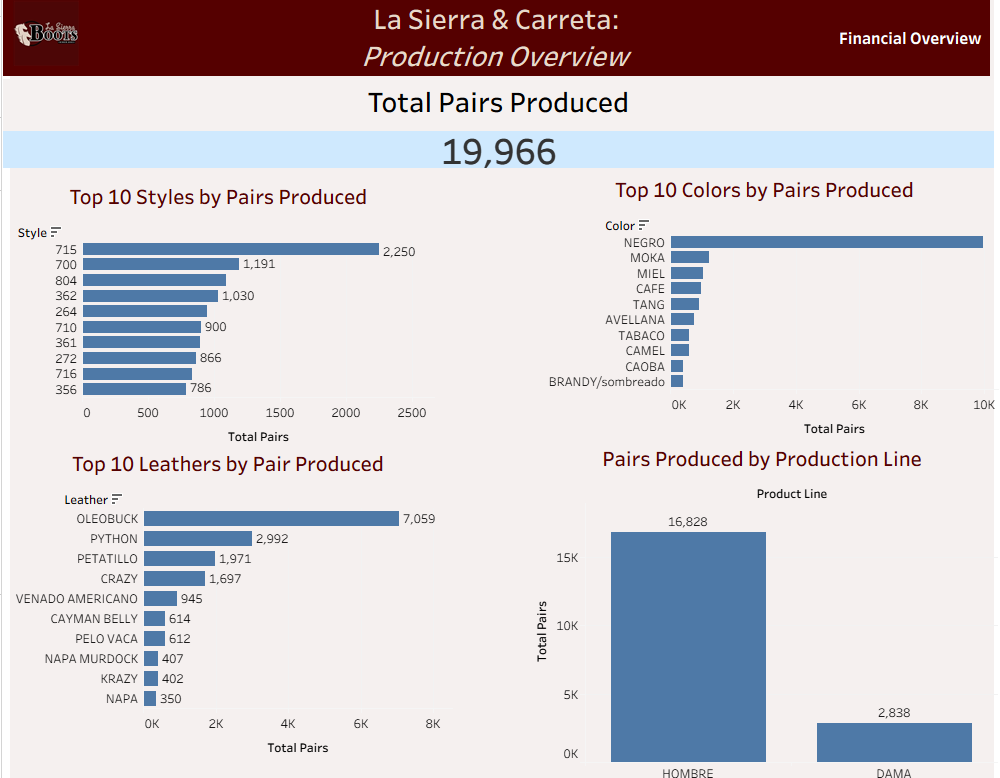

# Manufacturing Business Analytics Dashboard

Interactive Tableau dashboards developed for **La Sierra & Carreta**, a boot manufacturing and retail business, to transform historical financial and production data into an accessible business intelligence tool.

The project combines multi-year financial records with manufacturing data to help the business owner monitor performance, identify production trends, and explore key operational metrics.

## Dashboard Preview

### Executive Financial Overview

### Production Overview

## Project Objectives

The business maintained several years of financial and manufacturing information across Excel spreadsheets. The goal of this project was to clean and structure the data, define useful business KPIs, and build interactive dashboards that make the information easier to analyze.

The dashboards were designed to answer questions such as:

- How have sales and business outflows changed over time?
- Which years generated the highest sales?
- Which months produced positive or negative estimated operating results?
- Which boot styles are produced most frequently?
- Which leathers and colors are most commonly used?
- How is production distributed across product lines?

## Tools & Skills

- Tableau Desktop
- Microsoft Excel
- Data Cleaning
- Data Transformation
- Business Intelligence
- KPI Development
- Data Visualization
- Dashboard Design
- Exploratory Data Analysis
- Stakeholder Requirements

## Financial Dashboard

The Executive Financial Overview includes:

- Total Sales
- Inventory Purchases
- Operating Expenses
- Shipping Costs
- Estimated Operating Result
- Monthly Sales vs. Total Outflows
- Monthly Estimated Operating Result
- Annual Sales Trends
- Interactive Year Filtering
- Navigation between dashboards

The operating result metric was developed as an analytical management measure rather than an audited accounting profit figure.

## Production Dashboard

The Production Overview analyzes manufacturing activity through:

- Total Pairs Produced
- Top 10 Boot Styles
- Top 10 Colors
- Top 10 Leathers
- Production by Product Line

The dashboard includes interactive cross-filtering. Selecting a style, leather, color, or product line dynamically updates the other visualizations and production totals.

## Data Preparation

The source data consisted of operational Excel workbooks that required restructuring before analysis.

Data preparation included:

- Standardizing financial categories
- Structuring monthly financial records
- Cleaning manufacturing records
- Standardizing date and numeric fields
- Handling missing and inconsistent values
- Creating analysis-ready tables
- Defining calculated business metrics
- Separating complete and partial reporting periods

## Dashboard Features

- Interactive dashboard filtering
- Cross-filtering between production visuals
- Year-based financial analysis
- KPI summary metrics
- Dashboard navigation
- Multi-year trend analysis
- Consistent business branding and dashboard design

## Business Value

The project consolidates previously separate operational spreadsheets into a visual analytics tool that allows the business owner to review financial and manufacturing performance more efficiently.

Instead of manually reviewing individual spreadsheets, the dashboards provide a centralized view of major business metrics and production patterns.

## Key Insights

The dashboards make it possible to quickly identify:

- Long-term sales growth and year-over-year performance
- Months with stronger or weaker operating results
- High-volume boot styles
- Frequently used leather types and colors
- Differences in production volume across product lines

## Data Note

This project was developed using real operational data from La Sierra & Carreta with authorization from the business owner.

Financial figures shown are simplified management-level estimates used for analytical purposes and should not be interpreted as audited financial statements. Certain business information may also be modified or summarized for portfolio presentation.

## Author

**Luis Sicairos**

UCSB — Financial Mathematics & Statistics

Data Analytics | Business Intelligence | SQL | Tableau | Statistics
